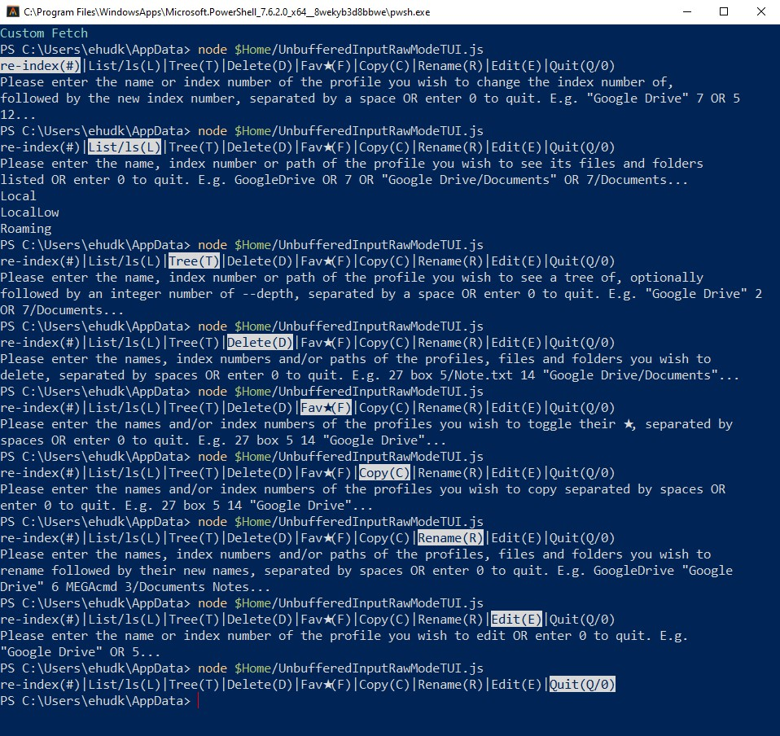

### Preview
This is what this demo looks like in Termux (Android). It looks similar on PC.

<table>
	<tr>
		<td>
			<video src="https://github.com/user-attachments/assets/b0975f91-316f-4eac-9b37-6d2bdc280ffa"></video>
		</td>
		<td>
			<video src="https://github.com/user-attachments/assets/2279ed25-1021-41bf-84b0-eaad196e71a5"></video>
		</td>
	</tr>
</table>

If you wonder how I customised Termux, including the Fetch I made there,<br>I plan to publish a repo in the future on how I managed this, so stay tuned.

### Main

This is a demo for a proposed TUI app for the CLI of AeroFTP 🚀, namely `aeroftp-cli profiles -i`. Hence,
<br>this repo on purpose has the same GPL-3.0 license. As such, it displays the same options as it for the user to choose from.
<br>I specifically proposed this demo for AeroFTP in its v4 wishlist post here: https://github.com/axpdev-lab/aeroftp/discussions/270#discussioncomment-17137604.
<br>The idea is to improve the speed and comfort of using interactive CLI over the experience that `aeroftp-cli profiles -i`, `rclone config` and others provide. 
<br>This demo can be used to improve the CLI of more other apps, and such improvements are welcome.

So what does this demo do? Well, in a nutshell, it allows the user to select an option out of several in the terminal like Y/N, for example when you're being asked whether you want to install a package in the terminal or not.
<br>Although it can be adjusted to show Y|N, it shows an example with significantly more options.
<br>This demo is better than many existing CLIs, including those I currently gave as examples. This is because this demo:

- Prevents wrong characters from being typed.
- Selects an option as soon as the user typed or pastes a valid character which represents an option,<br>so the user doesn't need to press Enter.
- Allows cycling through the options with the arrows keys ←↑→↓, Tab ⭾ and Shift ⇧ + Tab ⭾,<br>and the Page Up and Page Down keys, and then press Enter ↵.
	- The selected option stays highlighted to make it clear that it was selected without needing to print text to confirm this, which helps declutter.
	- It's possible to press Enter on the first option of # without having to use Shift to type it,<br>though that also works.
- This demo was specifically designed to work cross-platform, as the Page Up and Page Down keys on PC send different codes than PGUP and PGDN in Termux.
	Also, there needed to be a slight adjustment to make sure that there is exactly 1 line break '\n' in each OS when selecting the Quit option which doesn't print a message.<br>So the experience of this Demo in Termux is almost the same as on PC.
- Saves space by only using 1 or 2 lines in the terminal to display all options without repeating the same word like "remote" which `rclone config` writes. `rclone config` shows each option as a separate row which doesn't help make things clearer, it only wastes space. Here are the options `rclone config` displays:

	```txt
	e) Edit existing remote
	n) New remote
	d) Delete remote
	r) Rename remote
	c) Copy remote
	s) Set configuration password
	q) Quit config
	e/n/d/r/c/s/q>
	```
- Gives each option at least one character, which can be a letter, digit or symbol, and even multiple characters,<br>and writes the options in full.
	`aeroftp-cli profiles -i` writes the letters without writing what they each does.<br>Here are the options `aeroftp-cli profiles -i` displays:
	```txt
	Interactive: l/t/d/f/c/r/e <N|name> [N|name ...]  ·  legacy 1l/l1 still works  ·  0/q = quit
	profiles>
	```
	The options in this demo look as follows:
	```txt
	re-index(#)|List/ls(L)|Tree(T)|Delete(D)|Fav★(F)|Copy(C)|Rename(R)|Edit(E)|Quit(Q/0)
	```

Below is shown what this demo looks like in PowerShell (Windows) and Termux (Android). This should work wherever NodeJS run, so on other OS as well. To run this demo, save it as a file and run in a terminal: `node "Path to where you saved this script/UnbufferedInputRawMode.js`. This is what I call this script, because this is what I understand this concept is technically called. I like to use `$Home` (`C:\Users\<UserName>`) and `/sdcard` (`storage/shared`) shortcuts for paths in PowerShell and Termux as you'll see below. Each option has its own message and function, and I demonstrate List/ls here for the current directory from which this demo runs.

There is also a KeyboardTest.js file here as well which you can run in the same way, and what it does is it tests the code that NodeJS has for various key presses, including combinations with Shift ⇧, Ctrl and Alt.
<br>This is useful if you want to add more keys and combinations to control UnbufferedInputRawMode.js, or for other applications.

You can save both scripts as files by copying them or downloading them, as they're also attached.
<br>Both scripts are entirely self-contained and require no external dependencies to work, not even each other.

### Screenshots and Scripts

##### UnbufferedInputRawMode.js:



```js
/* This is a demo of a TUI/CLI app that doesn't let entering any character other than specific ones.
	Enter these in the following OS and terminals to trigger this script:
	Windows - PowerShell: node "$Home/Path to where you saved this script/UnbufferedInputRawMode.js"
	Android - Termux: node "/sdcard/Path to where you saved this script/UnbufferedInputRawMode.js"
*/

'use strict'

const fs=require('fs'),stdin=process.stdin,stdout=process.stdout
,options=[
	{label:'re-index',chars:['#'],msg:'\n\x1b[?25hPlease enter the name or index number of the profile you wish to change the index number of, followed by the new index number, separated by a space OR enter 0 to quit. E.g. "Google Drive" 7 OR 5 12...\n',func:function(){stdout.write(this.msg);process.exit()}},
	{label:'List/ls',chars:['l'],msg:'\n\x1b[?25hPlease enter the name, index number or path of the profile you wish to see its files and folders listed OR enter 0 to quit. E.g. GoogleDrive OR 7 OR "Google Drive/Documents" OR 7/Documents...\n',func:function(){stdout.write(this.msg+fs.readdirSync('.').join('\n')+'\n');process.exit()}},
	{label:'Tree',chars:['t'],msg:'\n\x1b[?25hPlease enter the name, index number or path of the profile you wish to see a tree of, optionally followed by an integer number of --depth, separated by a space OR enter 0 to quit. E.g. "Google Drive" 2 OR 7/Documents...\n',func:function(){stdout.write(this.msg);process.exit()}},
	{label:'Delete',chars:['d'],msg:'\n\x1b[?25hPlease enter the names, index numbers and/or paths of the profiles, files and folders you wish to delete, separated by spaces OR enter 0 to quit. E.g. 27 box 5/Note.txt 14 "Google Drive/Documents"...\n',func:function(){stdout.write(this.msg);process.exit()}},
	{label:'Fav★',chars:['f'],msg:'\n\x1b[?25hPlease enter the names and/or index numbers of the profiles you wish to toggle their ★, separated by spaces OR enter 0 to quit. E.g. 27 box 5 14 "Google Drive"...\n',func:function(){stdout.write(this.msg);process.exit()}},
	{label:'Copy',chars:['c'],msg:'\n\x1b[?25hPlease enter the names and/or index numbers of the profiles you wish to copy separated by spaces OR enter 0 to quit. E.g. 27 box 5 14 "Google Drive"...\n',func:function(){stdout.write(this.msg);process.exit()}},
	{label:'Rename',chars:['r'],msg:'\n\x1b[?25hPlease enter the names, index numbers and/or paths of the profiles, files and folders you wish to rename followed by their new names, separated by spaces OR enter 0 to quit. E.g. GoogleDrive "Google Drive" 6 MEGAcmd 3/Documents Notes...\n',func:function(){stdout.write(this.msg);process.exit()}},
	{label:'Edit',chars:['e'],msg:'\n\x1b[?25hPlease enter the name or index number of the profile you wish to edit OR enter 0 to quit. E.g. "Google Drive" OR 5...\n',func:function(){stdout.write(this.msg);process.exit()}},
	{label:'Quit',chars:['q','0'],msg:'',func:function(){stdout.write('\x1b[?25h'+this.msg+(process.platform==='win32'?'':'\n'));process.exit()}} // Check the OS to get the line break correctly.
]
,NumberOfOptions=options.length

for(let i=-1;++i<NumberOfOptions;){// Pre-compute formatted string properties at startup to save memory during menu navigation
	options[i].display=options[i].label+'('+options[i].chars.map(c=>c.toUpperCase()).join('/')+')'
	options[i].matchTerms=options[i].label.toLowerCase().split('/')
}

let selectedIndex=0,previousLines=0 // Track the current caret position and menu height

const renderMenu=()=>{// Build the visual menu string, calculate line wraps, and overwrite the terminal efficiently
	let output='',visibleText=''
	for(let i=-1;++i<NumberOfOptions;){
		const separator=i<NumberOfOptions-1?'|':''
		output+=(i===selectedIndex?'\x1b[7m':'')+options[i].display+(i===selectedIndex?'\x1b[0m':'')+separator
			/* The line above highlights focused and selected options in white and shows well only in terminals with dark background colours,
				so this will need some adjustment to look well in terminals with bright background colours.
			*/
		visibleText+=options[i].display+separator
	}
	const moveUp=previousLines>0?'\x1b['+previousLines+'A':''
	stdout.write(moveUp+'\x1b[0G\x1b[0J'+output)
	previousLines=Math.floor((visibleText.length-1)/(stdout.columns||80))
}
,executeOption=i=>{selectedIndex=i;renderMenu();options[i].func()}
,handleInput=key=>{
	switch(key){
		case '\u0003': // It's possible to quit with Ctrl+C or your terminal's equivalent
			stdout.write('\n\x1b[?25hCancelled with Ctrl+C\n');process.exit()
		break
		case '\u001b[A':  // Pressing the ↑ key
		case '\u001b[D':  // Pressing the ← key
		case '\u001b[Z':  // Pressing the Shift ⇧ + Tab ⭾ keys. Doesn't work in Termux.
		case '\u001b[5~': // Pressing the PGUP key in Termux
		case '\u001b[I':  // Pressing the Page Up key on PC
			selectedIndex=(selectedIndex-1+NumberOfOptions)%NumberOfOptions // Cycle backwards
			renderMenu()
		break
		case '\u001b[B':  // Pressing the ↓ key
		case '\u001b[C':  // Pressing the → key
		case '\t':        // Pressing the Tab ⭾ key OR entering a '	' tab. This only cycles one forward even if you hold it in Termux, but cycles fine on PC.
		case '\u001b[6~': // Pressing the PGDN key in Termux
		case '\u001b[G':  // Pressing the Page Down key on PC
			selectedIndex=(selectedIndex+1)%NumberOfOptions // Cycle forwards
			renderMenu()
		break
		/* These keys don't work if you set them to perform certain actions in your terminal configuration files like in alacritty.toml and .wezterm.lua.
			I personally set the Page Up and Page Down keys in Alacritty and WezTerm to scroll up and down for example.
		*/
		// Use the Keyboard Test script below to find the codes of key presses, including combinations with Shift ⇧, Ctrl and Alt.
		case '\r':
		case '\n':
			options[selectedIndex].func()
		break
		default:// Normalise text for handling pasted strings and multi-character buffers
			const lowerKey=key.toLowerCase(),trimmedKey=lowerKey.trim(),trimmedKeyLength=trimmedKey.length
			
			if(trimmedKeyLength>1&&!key.startsWith('\u001b')){// Check if the input is a pasted word rather than a single escape sequence
				let found=false
				for(let i=-1;++i<NumberOfOptions;){// Attempt to match the pasted word against full labels (e.g. "re-index")
					if(options[i].matchTerms.includes(trimmedKey)){
						executeOption(i)
						found=true
						break
					}
				}
				if(!found){// Scan each pasted character until finding an option
					searchLoop:for(let j=-1;++j<trimmedKeyLength;){
						for(let i=-1;++i<NumberOfOptions;){
							if(options[i].chars.includes(trimmedKey[j])){
								executeOption(i)
								break searchLoop
							}
						}
					}
				}
			}else{// Handle standard single keystroke shortcut matches
				for(let i=-1;++i<NumberOfOptions;){
					if(options[i].chars.includes(lowerKey)){
						executeOption(i)
						break
					}
				}
			}
	}
}

// Hide the caret and perform the interactive session
stdout.write('\x1b[?25l');stdin.setRawMode(true);stdin.resume();stdin.setEncoding('utf8');renderMenu();stdin.on('data',handleInput)
```

##### KeyboardTest.js:


```js
'use strict'

const detectKey=()=>{
	const stdin=process.stdin
	console.log("Press any key or combination of keys to see its raw sequence. Press Ctrl+C or your terminal's equivalent to exit.")
	stdin.setRawMode(true);stdin.resume();stdin.setEncoding('utf8')
	stdin.on('data',key=>{key==='\u0003'&&process.exit();console.log(JSON.stringify(key))})
}

detectKey() /* Enter these in the following OS and terminals to trigger this script:
	Windows - PowerShell: node "$Home/Path to where you saved this script/KeyboardTest.js"
	Android - Termux: node "/sdcard/Path to where you saved this script/KeyboardTest.js"
*/
```

### Installing Apps

|OS|Windows 💻|Android 📱|
|-|-|-|
|Source & Installer Client|WinGet - [UniGetUI](https://apps.microsoft.com/detail/XPFFTQ032PTPHF)|<ul><li>[F-Droid](https://f-droid.org) - [Droid-ify](https://droidify.eu.org)</li><li>GitHub - [Obtainium](https://obtainium.imranr.dev)</li></ul>|
|>_ Terminals|<ul><li>`Microsoft.PowerShell` (Modern pwsh PowerShell)</li><li>`Alacritty.Alacritty`</li><li>`wez.wezterm`</li></ul>|[Termux](https://termux.dev)|
|>_ NodeJS|`OpenJS.NodeJS`|`pkg install nodejs`|
|⌨ Keyboard|N/A|[FUTO](https://futo.tech/projects)|
|KDE Connect|`KDE.KDEConnect`|[KDE Connect](https://kdeconnect.kde.org)|

You can install Termux from either F-Droid or GitHub. Do NOT install Termux from the Google Play Store!
<br>You can read why in https://github.com/termux/termux-app/discussions/4000.

I chose NodeJS because that's the easiest runtime for me to work with,
<br>and I wanted something that works in both PowerShell and Termux, so I didn't choose Shell and PowerShell.

I use pwsh inside Alacritty and WezTerm.
<Br>If you wonder how, I'll publish a repo on this in the future and link it here, so stay tuned for that.

If you're curious how I screen-recorded my phone, it has that option as a quick tile. If you wonder how I showed a cursor in the preview, I used the 'Remote input' feature of KDE Connect. I connected over USB Tethering 🔌 to keep latency low.
<br>If you're curious how my phone's keyboard had those ∧ ∨ < > keys, I use the FUTO keyboard app.

The code blocks in this table are WinGet Package IDs to search for in UniGetUI/WinGet and a command line to enter in Termux to install.
